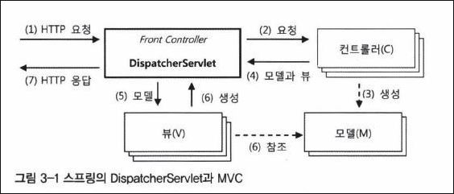
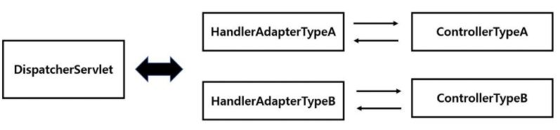

# 3.1.2 스프링 MVC와 DispatcherServlet 전략
## DispatcherServlet과 MVC 아키텍처
- 스프링의 웹 기술은 MVC 아키텍처를 근간으로 하고 있다.
- MVC는 프레젠테이션 계층의 구성요소를 정보를 담은 모델(M), 화면 출력 로직을 담은 뷰(V), 그리고 제어 로직을 담은 컨트롤러(C)로
  분리하고 이 세가지 요소가 서로 협력해서 하나의 웹 요청을 처리하고 응답을 만들어내는 구조다.
- MVC 아키텍처는 보통 프론트 컨트롤러(front controller) 패턴과 함께 사용된다.
- 프론트 컨트롤러 패턴은 중앙집중형 컨트롤러를 프레젠테이션 계층의 제일 앞에 둬서 서버로 들어오는 모든 요청을 먼저 받아 처리하게 만든다.
- 프론트 컨트롤러는 클라이언트가 보낸 요청을 받아서 공통적인 작업을 먼저 수행한 후에 적절한 세부 컨트롤러로 작업을 위임해주고,
  클라이언트에게 보낼 뷰를 선택해서 최종 결과를 생성하는 등의 작업을 수행한다.
- 예외가 발생했을 때 이를 일관된 방식으로 처리하는 것도 프론트 컨트롤러의 역할이다.
- 프론트 컨트롤러는 컨트롤러와 뷰, 그리고 그 사이에서 주고받는 모델, 세 가지를 이용해서 작업을 수행하는게 일반적이다.
- 스프링이 제공하는 스프링 서블릿/MVC의 핵심은 DispatcherServlet이라는 프론트 컨트롤러다.
- DispatcherServlet은 MVC 아키텍처로 구성된 프레젠테이션 계층을 만들 수 있도록 설계되어 있다.
- 다음은 DispatcherServlet이 프론트 컨트롤러로 MVC 컴포넌트들과 동작하는 기본적인 구조를 보여준다.   
  

### (1) DispatcherServlet의 HTTP 요청 접수
- 자바 서버의 서블릿 컨테이너는 HTTP 프로토콜을 통해 들어오는 요청이 스프링의 DispatcherServlet에 할당된 것이라면
  HTTP 요청정보를 DispatcherServlet에 전달해준다.
- web.xml에는 보통 다음과 같이 DispatcherServlet이 전달받을 URL 패턴이 정의되어 있다.
  ```xml
  <servlet-mapping>
    <servlet-name>Spring MVC Dispatcher Servlet</servlet-name>
    <url-pattern>/app/*</url-pattern>
  </servlet-mapping>
  ```
- \<servlet-mapping>은 URL이 /app으로 시작하는 모든 요청을 DispatcherServlet에게 할당해주는 것이다.
- 특정 폴더 아래의 내용을 매핑하는 방법도 가능하고, *.do와 같이 특정 확장자만을 매핑해주는 방법도 쓸 수 있다.
- DipatcherServlet은 모든 요청에 대해 공통적으로 진행해야 하는 전처리 작업이 등록된 것이 있다면 이를 먼저 수행한다.
- 공통적으로 이용 가능한 보안이나 파라미터 조작, 한글 디코딩과 같은 작업이 적용된다.

### (2) DipatcherServlet에서 컨트롤러로 HTTP 요청 위임
- DispatcherServlet은 URL이나 파라미터 정보, HTTP 명령 등을 참고로 해서 어떤 컨트롤러에게 작업을 위임할지 결정한다.
- 컨트롤러를 선정하는 것은 DispatcherServlet의 핸들러 매핑 전략을 이용한다.
- 스프링에서는 컨트롤러 핸들러라고도 부른다.
- DispatcherServlet에는 어떤 컨트롤러라도 사용 가능하다.
- DispatcherServlet은 컨트롤러가 어떤 메소드를 가졌고 어떤 인터페이스를 구현했는지 알지 못한다.
  대신 컨트롤러의 종류에 따라 적절한 어댑터를 사용한다.
- 각 어댑터는 자신이 담당하는 컨트롤러에 맞는 호출 방법을 이용해서 컨트롤러에 작업을 요청하고 결과를 돌려받아서
  DispatcherServlet에게 다시 돌려주는 기능을 갖고 있다.
- 이렇게 하면 하나의 DispatcherServlet이 동시에 여러가지 타입의 컨트롤러를 사용할 수 있다.
- 어떤 어댑터를 사용할지는 DispatcherServlet 전략의 하나인 핸들러 어댑터 전략을 통해 결정한다. 당연히 DI를 통해 자유롭게 확장 가능하다.
  
- DispatcherServlet이 핸들러 어댑터에 웹 요청을 전달할 때는 모든 웹 요청정보가 담긴 HttpServletRequest 타입의 오브젝트를 전달해준다.
- 이를 어댑터가 적절히 변환해서 컨트롤러의 메소드가 받을 수 있는 파라미터로 변환해서 전달해주는 것이다.
- HttpServletResponse도 함께 전달해 준다. 드물긴 하지만 컨트롤러가 결과를 리턴값으로 돌려주는 대신 HttpServletResponse 오브젝트 안에 직접 집어넣을 수도 있기 때문이다.

### (3) 컨트롤러의 모델 생성과 정보 등록

### (4) 컨트롤러의 결과 리턴: 모델과 뷰

### (5) DipatcherServlet의 뷰 호출과 (6) 모델 참조

### (7) HTTP 응답 돌려주기